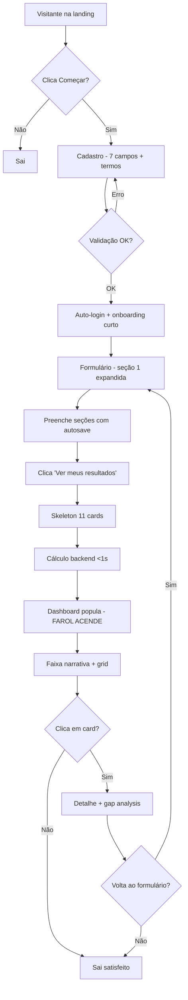
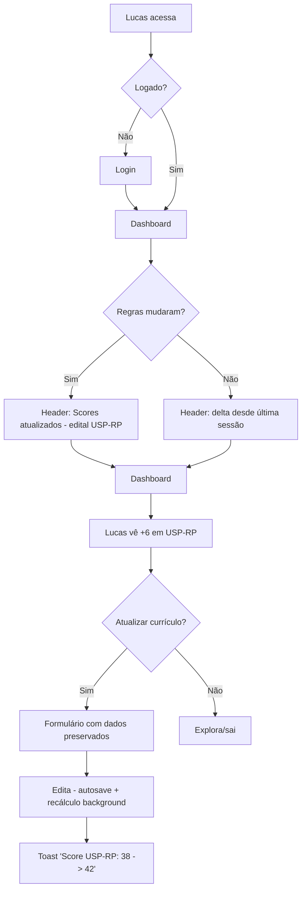
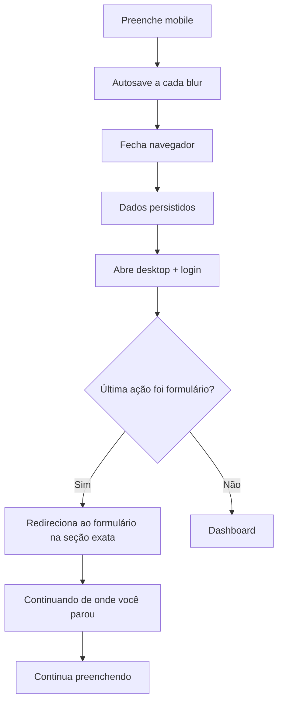
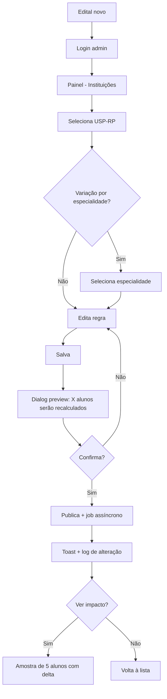
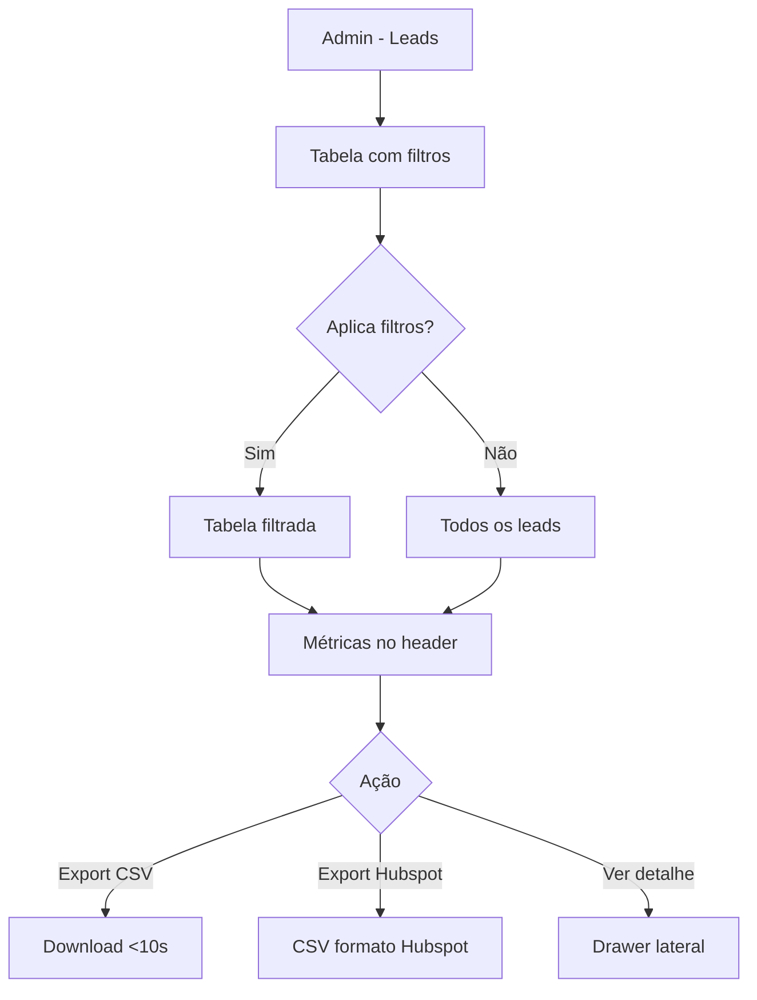

# UX Design Specification — Medway Currículo

**Author:** Rcfranco
**Date:** 2026-04-13

---

<!-- UX design content will be appended sequentially through collaborative workflow steps -->

## Executive Summary

### Project Vision

Medway Currículo é uma plataforma web de diagnóstico curricular para estudantes de medicina candidatos a residência, entregando dois aha moments principais: "sei onde estou" (score por instituição) e "sei o que me falta" (gap analysis). Atua como farol de orientação (uso ~mensal), gerando simultaneamente leads qualificados para o funil comercial Medway.

### Target Users

**Aluno (Lucas):** 22–28 anos, do ciclo básico ao recém-formado, tech-savvy médio, familiarizado com a marca Medway. Usa majoritariamente desktop/notebook com brechas de mobile. Emocionalmente: ansioso com o futuro, motivado por clareza, sensível a comparação social.

**Admin (Rcfranco):** operador único, acumula dev/produto/operação. Uso em rajadas na temporada de editais (jul–nov). Precisa de ergonomia de CRUD, eficiência e confiança no recálculo.

### Key Design Challenges

1. Formulário denso sem perda de motivação — autosave, progresso visual, saída/retorno fluido
2. Resultado emocionalmente carregado — transformar choque do score em agência via gap analysis
3. Comparação cross-institucional — 11 instituições × especialidades com hierarquia calma
4. Dupla audiência (aluno × admin) — dois mundos distintos sob a mesma marca
5. LGPD + disclaimer de estimativa sem poluir o fluxo

### Design Opportunities

1. Gap analysis como herói visual, não como apêndice do score
2. Design emocionalmente inteligente — celebrar progresso no retorno (farol funcionando)
3. Densidade elegante no dashboard usando Design System Medway (Navy/Teal/Montserrat)
4. Autoridade de marca Medway como ativo de conversão — microcopy, tipografia, honestidade

## Core User Experience

### Defining Experience

A experiência central é o momento de revelação: após preencher ou atualizar o currículo, o aluno vê scores por instituição acompanhados do gap analysis. O arco emocional é **choque → direção → plano**. O loop primário: preencher → ver → entender gap → sair com clareza → voltar em ~1 mês para reavaliar. Para o admin, a experiência central é atualizar uma regra de edital com confiança de que o recálculo é correto.

### Platform Strategy

Web app responsivo desktop-first. Landing pública via SSG (SEO/velocidade), app autenticada como SPA. Preenchimento mobile precisa ser funcional (alvos touch adequados), mas dashboard de resultados é otimizado para tela grande. Sem offline, sem capacidades de device no MVP.

### Effortless Interactions

1. Autosave transparente sem botão salvar
2. Retorno entre dispositivos cai no estado exato onde parou
3. Dashboard é a primeira tela ao logar — score visível sem clique
4. Card da instituição expande para detalhe/gap de forma natural (não menu)
5. Link do edital acessível sem sair do contexto (nova aba)
6. Recálculo <1s ao editar um campo, com feedback visual

### Critical Success Moments

- **Primeiro score visto:** instantâneo, sem erro, sem loading longo
- **Primeiro gap analysis:** transforma choque em direção em <10s
- **Cadastro:** leve o suficiente para não perder o lead
- **Retorno após ~1 mês:** score subiu — farol funcionou
- **Admin atualiza regra:** confiança de que recálculo propagou corretamente
- **LGPD e disclaimer:** presentes sem quebrar fluidez

### Experience Principles

1. **Revelação antes de interação** — mostrar antes de pedir
2. **Choque com saída** — todo número pesado vem com caminho (gap analysis junto do score)
3. **Persistência é promessa** — autosave é identidade, não feature
4. **Densidade calma** — 11 instituições cabem sem ansiedade, via hierarquia visual
5. **Honestidade acima de marketing** — disclaimer e edital como ativos de confiança
6. **Duas personalidades sob uma marca** — aluno inspiracional/orientador; admin funcional/eficiente

## Desired Emotional Response

### Primary Emotional Goals

**Clareza com agência** — o aluno sai de cada sessão com a sensação de ter um farol, não um juiz. Da névoa para "sei onde estou e sei o próximo passo". Frase-teste: *"saí daqui sabendo o que fazer na segunda de manhã."*

Secundárias: confiança na fonte (marca Medway + edital), progresso tangível no retorno, pertencimento silencioso, competência instrumental (admin).

### Emotional Journey Mapping

| Estágio | Emoção desejada | Emoção a evitar |
|---|---|---|
| Landing | Curiosidade séria, reconhecimento de marca | Marketing agressivo |
| Cadastro | Conforto, rapidez | "Formulário pesado demais pra lead" |
| Formulário de currículo | Foco calmo, controle, progresso | Exaustão, ansiedade, medo de perder dados |
| Primeiro score | Impacto + clareza imediata | Veredito, julgamento |
| Gap analysis | Agência, "aha" | Sobrecarga, lista infinita |
| Saída primeira sessão | Propósito | Desorientação |
| Erro/interrupção | Tranquilidade ("nada se perdeu") | Pânico |
| Retorno ~1 mês | Satisfação de progresso | Indiferença |
| Admin editando regra | Controle sóbrio | Medo de quebrar |

### Micro-Emotions

1. Confiança vs. ceticismo — dominante
2. Realização vs. frustração — crítica no primeiro score
3. Empolgação contida vs. ansiedade — aluno já chega ansioso; design acalma
4. Delicadeza vs. brutalidade — score baixo apresentado com humanidade
5. Pertencimento implícito via marca Medway (sem UI social no MVP)

### Emotions to Avoid

Julgamento, paralisia, culpa/vergonha, comparação social agressiva, ansiedade de formulário, desconfiança de números sem fonte.

### Design Implications

- **Clareza com agência** → gap analysis com peso visual ≥ score; verbos de ação
- **Confiança na fonte** → link do edital em cada instituição; disclaimer elegante; Montserrat/navy
- **Progresso no retorno** → delta visível ("+6 pontos desde 12/mar"); celebração sutil
- **Sem julgamento** → score sempre contextualizado ("+28 pontos disponíveis"), nunca isolado
- **Foco calmo no formulário** → uma seção visível por vez, autosave silencioso, validação não intrusiva
- **Tranquilidade em erro** → toast neutro, sem modais bloqueantes, estado recuperado em silêncio
- **Densidade calma** → grid uniforme, teal como sinal de ação, cor como sinal não ruído
- **Delicadeza com score baixo** → sem vermelho, gradiente neutro→positivo, "espaço de crescimento" > "gap"
- **Controle admin** → confirmação + preview de impacto + log de alterações

### Emotional Design Principles

1. **Farol, não juiz** — número orienta, não julga
2. **Choque tem par obrigatório** — score nunca sem caminho ao lado
3. **Calma é a estética** — densidade alta, ansiedade baixa
4. **Progresso celebrado discretamente** — sem gamificação, delta + microcopy bastam
5. **Honestidade produz confiança** — disclaimer e edital como herói da confiança
6. **Linguagem humanizada** — "espaço para crescer" > "gap"

## UX Pattern Analysis & Inspiration

### Inspiring Products Analysis

**Nubank — confiança + microcopy humana**
Cadastro leve em etapas curtas, microcopy em 1ª/2ª pessoa sem jargão, estados vazios acolhedores, hierarquia visual calma (tipografia grande, espaços amplos, cor como acento), honestidade institucional de termos e tarifas.

**Strava — métricas pessoais com progresso respeitoso**
Progresso como narrativa temporal ("+12s/km este mês"), cards de atividade como unidade de leitura (hero metric + detalhes secundários), celebração discreta de PRs, detalhe acessível em drill-down (não listagem).

**Linear — densidade calma, hierarquia elegante (referência admin)**
Listas com peso visual modulado, inline editing, command palette, feedback discreto (toasts não bloqueantes), sistema visual monocromático coerente.

Referências secundárias: Guia Medway (marca/tom), protótipo Lovable atual (manter cálculo por categorias e cards de instituição, descartar UX genérica).

### Transferable UX Patterns

**Navegação:**
- Dashboard como primeira tela pós-login (Strava/Linear)
- Card como unidade de leitura expansível (Strava) — instituição é um card
- Sidebar leve no app, não menus hambúrguer em desktop (Linear)

**Interação:**
- Autosave silencioso com confirmação discreta via toast (Linear/Notion)
- Inline editing no formulário; sem "modo edição" separado
- Drill-down em vez de navegação hierárquica
- Command palette admin (pós-MVP)

**Visual:**
- Tipografia hierárquica forte, única família (Montserrat, 4–5 tamanhos)
- Cor como sinal, não ruído: navy estrutura, teal ação/destaque, cinzas para densidade
- Espaço em branco como hierarquia
- Números grandes com contexto pequeno ("32/100 · USP-SP")
- Skeleton loading em vez de spinners

**Emocional:**
- Microcopy humana em 1ª/2ª pessoa ("Você tem espaço para crescer aqui")
- Delta temporal celebrado discretamente ("+6 pts desde 12/mar")
- Estado vazio convidativo ("Adicione sua primeira publicação")

### Anti-Patterns to Avoid

1. Gamificação de streaks diários (Duolingo) — uso é mensal por design
2. Score isolado em hero gigante sem gap ao lado
3. Comparação social agressiva (percentis, ranking de usuários)
4. Formulário em wizard linear obrigatório — quebra persistência
5. Dashboard estilo cockpit com muitos gauges
6. Pop-ups de captação agressivos — degrada autoridade Medway
7. Validação em tempo real punitiva (vermelho ao digitar)
8. Spinners longos genéricos — usar skeleton ou sub-segundo

### Design Inspiration Strategy

| Fonte | Adotamos | Para |
|---|---|---|
| Nubank | Microcopy humana, cadastro leve, estados vazios convidativos | Confiança + baixa fricção de lead |
| Strava | Card como unidade, delta temporal, drill-down de detalhes | Dados pessoais sem julgamento |
| Linear | Densidade calma, autosave discreto, inline editing | Dashboard denso + admin eficiente |
| Medway (marca) | Navy/teal, Montserrat, tom institucional | Coerência com ecossistema |
| Duolingo (anti) | Evitar streaks e gamificação | Uso mensal sem culpa |
| Calculadoras genéricas (anti) | Evitar score isolado e comparação social | Farol, não juiz |

**Adaptações (não cópia direta):**
- Cards Strava → card de instituição com score + gap resumido + link do edital
- Cadastro Nubank em etapas → nosso cadastro em um único formulário agrupado visualmente
- Listas Linear → regras por instituição no admin, sem todo o sistema status/priority
- Progresso Strava → "seu farol" visual sutil, sem medalhas

## Design System Foundation

### 1.1 Design System Choice

**shadcn/ui + Radix UI + Tailwind CSS, tematizado pelo Design System Medway**

Base de componentes copiados (não dependência) construídos sobre primitives Radix, estilizados via Tailwind CSS com tokens mapeados para a paleta e tipografia Medway (Navy #00205B, Teal #01CFB5, Montserrat).

### Rationale for Selection

1. **Stack já instalado** no repositório (confirmado pela arquitetura) — trocar queimaria semanas do prazo crítico de fim de abril/2026
2. **shadcn/ui é código copiado**, não dependência — customização total sem briga com upstream
3. **Radix UI** entrega acessibilidade de verdade (teclado, ARIA, focus management), cumprindo NFR15–NFR18 sem esforço adicional
4. **Tailwind + design tokens** propagam paleta/tipografia Medway de um único ponto
5. **Componentes densos** (Table, Form, Card, Dialog) servem tanto ao dashboard emocional do aluno quanto ao CRUD eficiente do admin
6. **Ecossistema maduro** — DataTable pronto para leads, Form + react-hook-form pronto para currículo

### Implementation Approach

**Camada 1 — Tokens Medway em `tailwind.config.ts`:**
Paleta (navy/teal/neutros), Montserrat como `sans`, escala de espaçamento padrão Tailwind. Sobrescrever CSS vars do shadcn (`--primary`, `--accent`, `--background`).

**Camada 2 — Componentes shadcn/ui base:**
Button, Card, Input, Form, Dialog, Dropdown, Tabs, Table, Toast, Skeleton, Tooltip. Adicionar faltantes via `npx shadcn add`.

**Camada 3 — Componentes de domínio (`src/components/`):**
- ScoreCard (card de instituição)
- GapAnalysisPanel
- CurriculoSection (forms agrupados + autosave)
- AdminRuleEditor
- LeadTable

**Camada 4 — Ícones:** Lucide (peso de traço compatível com densidade calma).

### Customization Strategy

- **Tokens como fonte única de verdade** — `tailwind.config.ts` define tudo; alterar paleta mexe em um lugar
- **Variants shadcn preservadas** com visual Medway (default = navy, accent = teal)
- **Sem componentes paralelos** — se shadcn tem, usa shadcn; não duplica
- **Dark mode preparado mas desligado no MVP** (variáveis dark setadas, toggle oculto)
- **Tipografia Montserrat** via `@fontsource` com `font-display: swap` e preload dos pesos 400/500/600/700
- **Densidade via padding tokens** — `p-3` denso (admin), `p-6` respirável (aluno)
- **HSL para CSS vars** — converter hex Medway para HSL conforme exigência do shadcn

## 2. Core User Experience

### 2.1 Defining Experience

**"Ver o farol acender"** — o momento em que o aluno termina a última seção do currículo, a tela transiciona do formulário para o dashboard, e os 11 cards de instituição aparecem populados com scores e gap resumido ao lado. Este é o equivalente do "swipe → match": 3 segundos que carregam a promessa do produto inteiro.

### 2.2 User Mental Model

Lucas pensa seu currículo como um CV estruturado (lista de realizações), espera output como nota oficial (modelo vestibular), e quer resultado que pareça oficial (modelo edital). Atalhos atuais: planilhas Excel, grupos WhatsApp, leitura manual de editais. Principais confusões previsíveis:

- Troca de especialidade muda todos os scores (não óbvio)
- Escala de pontuação não é universal (varia por edital)
- Scores parciais enquanto currículo incompleto
- O que acontece quando edital muda

### 2.3 Success Criteria

- Latência <1s do "ver resultados" até dashboard populado (NFR3)
- Transição visível (fade+slide ~200ms), não corte seco
- Todos os 11 cards aparecem de uma vez, não sequencialmente
- Cada card: Instituição + Score + Barra visual + 1 linha de gap
- Sem modais, sem tutorial, auto-explicativo
- Drill-down em 1 clique, volta ao formulário em 1 clique

**Indicadores de sucesso (métricas UX):**

- Tempo no dashboard após primeiro score: >60s
- Drill-down em ao menos 1 card: >70%
- Retorno em 30 dias: ≥25%
- Volta ao formulário para ajustar: >40%

### 2.4 Novel UX Patterns

Combinação familiar com pequeno twist. Padrões estabelecidos adotados: formulário multi-seção com autosave, dashboard com cards de métricas, drill-down expansível, progress bar horizontal para gap. Twist único:

- **Par obrigatório score + gap no mesmo card** (dashboards comuns mostram só métrica)
- **11 instituições contextualmente comparáveis** (não é "suas métricas", é "sua posição em 11 concursos distintos" — cross-referencial)

Sem necessidade de tutorial — pattern legível para quem já usou dashboard.

### 2.5 Experience Mechanics

**1. Iniciação**

- Primário: CTA "Ver meus resultados" ao final da última seção do formulário
- Alternativo: login pós-sessão anterior — dashboard é tela padrão
- Elegibilidade: ao menos uma seção respondida; senão, estado vazio convidativo

**2. Interação**

- Clique no CTA → transição fade+slide (~200ms)
- Skeletons dos 11 cards aparecem instantaneamente
- Cálculo backend <1s → cards populados em uma única atualização
- Ordenação: do maior score para o menor (balança o choque emocional)
- Card: Instituição · Score X/Y · Barra visual · Linha resumida de gap · Chevron
- Header: "Sua posição em 11 instituições" + especialidade (editável inline) + disclaimer

**3. Feedback**

- Durante cálculo: skeleton animado (não spinner)
- Hover no card: elevação sutil + chevron em teal (clicabilidade)
- Primeira visita: tooltip dismissível discreto no primeiro card
- Erro: toast não bloqueante com retry; dados preservados
- Currículo parcial: badge "Parcial" + CTA de voltar

**4. Completude**

- Dashboard é o estado de descanso; não há "fim"
- Outcome ideal: aluno clica em ≥1 card (second wow do gap analysis)
- Próximo passo implícito, não prescritivo
- Saída: aluno fecha sabendo o que fazer; volta em ~30 dias

**Mecânica secundária — retorno do aluno:**

- Login → dashboard com recálculo automático se regras mudaram
- Header mostra delta humanizado ("Seu score subiu +6 em USP-SP desde 12 de março")
- Sem mudanças = dashboard idêntico (previsibilidade)
- CTA discreto "Atualizar meu currículo" preserva estado

## Visual Design Foundation

### Color System

**Paleta primária Medway:**

- `navy.900` #00205B — estrutura (texto, headers, bordas de autoridade)
- `navy.700/800` — hover/variação
- `teal.500` #01CFB5 — accent (ações, chevrons, barras de progresso)
- `teal.600` #01A695 — teal para texto (atende contraste WCAG AA)

**Neutros (densidade calma):** neutral.0 (branco) → neutral.900 (#0F172A); tons intermediários para bordas (200), texto secundário (400/600), fundos (50/100).

**Semânticos sóbrios:**

- `success` #10B981 (autosave, delta positivo)
- `warning` #F59E0B (disclaimer, parcial) — âmbar, não vermelho
- `danger` #DC2626 (exclusivo para erros técnicos e exclusão — **nunca** score baixo)
- `info` #3B82F6 (tooltips neutros)

**Princípios de cor:**

1. Navy é estrutura, não decoração
2. Teal é ação, não ornamento
3. Score baixo nunca em vermelho — barra usa navy.200 (fundo) + teal.500 (progresso)
4. Máximo 2 cores de acento por tela

Mapeamento HSL para CSS vars do shadcn definido (`--primary` 224 100% 18%, `--accent` 173 99% 41%, etc.).

### Typography System

**Família única:** Montserrat (400/500/600/700) via `@fontsource` com `font-display: swap`.

**Escala tipográfica:**

| Token | Tamanho | Peso | Uso |
|---|---|---|---|
| display | 48/56px | 700 | Landing hero |
| h1 | 32px | 700 | Título de página |
| h2 | 24px | 600 | Seção |
| h3 | 20px | 600 | Nome de instituição no card |
| body-lg | 18px | 400 | Intro de seção |
| body | 16px | 400 | Corpo padrão |
| body-sm | 14px | 400 | Labels de formulário, microcopy |
| caption | 12px | 500 | Disclaimer, metadata |
| score-hero | 64/96px | 700 | Score no detalhe da instituição |

**Princípios:**

1. Uma única família — Montserrat do display ao caption
2. Hierarquia por tamanho + peso, nunca por cor
3. Line-height generoso (1.5–1.6) no corpo
4. Tabular numerals (`font-feature-settings: 'tnum'`) em scores/datas
5. Sem italic no MVP

### Spacing & Layout Foundation

**Escala base:** 4px (Tailwind padrão); tokens `space-1` a `space-16` cobrindo 4px–64px.

**Containers:**

- `max-w-7xl` (1280px) — primário, dashboard
- `max-w-3xl` (768px) — formulário de currículo
- `max-w-5xl` (1024px) — landing

**Grid do dashboard:**

- Desktop ≥1280px: 4 colunas
- Tablet 768–1279px: 3 colunas
- Mobile <768px: 1 coluna

**Densidades por audiência:**

- Aluno (app): respirável — padding `space-6`, gaps `space-8`
- Admin (painel): denso — padding `space-3`/`space-4`, tabelas compactas
- Landing: generosa — `space-12`/`space-16` entre seções

**Bordas e sombras:**

- Border radius: `sm` 4px (chips), `md` 8px (inputs/buttons), `lg` 12px (cards — padrão), `xl` 16px (modais)
- Sombras parcimoniosas: `sm` (repouso), `md` (hover), `lg` (modais); sem glow
- Bordas `neutral.200` substituem sombra em densidade admin

**Princípios de layout:**

1. Respiração por padrão; pressão só quando requisito (admin)
2. Alinhamento duro em grid estrito
3. Hierarquia por escala, não por cor
4. Texto longe da borda (mínimo `space-4` em cards respiráveis)
5. Dashboard mostra ≥6 cards acima da dobra em 1440px

### Accessibility Considerations

**Contraste (WCAG AA / NFR15):**

- Navy.900 sobre branco: 17.2:1 ✅ AAA
- Teal.600 sobre branco: 4.6:1 ✅ (usar este para texto; teal.500 só para UI não-textual)
- Neutral.600 sobre branco: 7.3:1 ✅

**Tipografia acessível:**

- Corpo mínimo 16px, labels 14px (NFR18)
- Caption 12px apenas para metadata não essencial

**Navegação por teclado (NFR17):**

- Focus ring visível: `ring-2 ring-teal-500 ring-offset-2`
- Skip link no topo
- Trap focus em modais/dropdowns (Radix default)
- Atalhos admin pós-MVP (`cmd+k`)

**Outras:**

- Labels sempre associadas via `htmlFor` (NFR16)
- Alt text em todas as imagens (vazio se decorativa)
- `prefers-reduced-motion` respeitado
- Cor nunca única portadora de informação (gap = barra + número + texto)

## Design Direction Decision

### Design Directions Explored

Três direções foram avaliadas para a tela-definidora (Dashboard):

**Direção 1 — Grid Calmo:** 11 cards uniformes em grid 4 colunas, ordenados por score. Analogia Strava/Linear. Prioriza comparação cross-institucional e densidade calma.

**Direção 2 — Ranking Emocional:** Hero card para top-1 seguido de lista densa. Analogia Spotify Wrapped. Prioriza narrativa e celebração do ponto forte.

**Direção 3 — Dois Painéis:** Layout split (lista à esquerda / detalhe à direita sticky). Analogia Apple Health. Prioriza zero-clique para gap analysis.

### Chosen Direction

**Direção 1 (Grid Calmo) como base, com empréstimo da Direção 2 (faixa narrativa).**

Grid de 11 cards iguais em 4 colunas (desktop), com uma faixa narrativa de 1 linha acima do grid sintetizando destaque + oportunidade ("Você está mais competitivo em USP-RP (68). Maior oportunidade: +51 em UNIFESP, publicações.").

### Design Rationale

1. Melhor fit com princípio "densidade calma" e padrões Linear/Strava adotados
2. Comparação cross-institucional é coração do produto — Direção 1 entrega sem concessão
3. Menor custo de implementação (shadcn Card em grid) — respeita prazo
4. Mobile colapsa naturalmente para stack vertical sem redesign
5. Escalável para 20+ instituições no futuro
6. Faixa narrativa adiciona camada emocional sem comprometer comparação visual

**Rejeitamos:**

- Hero isolado da Direção 2 — enviesa leitura
- Layout split da Direção 3 — quebra mobile e esconde comparação

### Implementation Approach

**Dashboard:**

- Header compacto: logo + seletor de especialidade inline + menu de usuário
- Subheader: título + disclaimer pequeno
- Faixa narrativa (1 linha, card `neutral.50` com ícone 🧭)
- Grid 4 colunas desktop / 3 tablet / 1 mobile
- Card uniforme: Instituição (h3) + Score (score-hero 48px) + Barra + Gap em 1 linha + chevron
- Ordenação padrão: maior → menor score

**Detalhe da instituição (drill-down):**

- Breadcrumb "← Dashboard"
- Header: nome + especialidade + link para edital (ícone externo)
- Score em score-hero 96px + barra de progresso ampla
- Lista vertical de categorias: nome + X/Y + mini-barra + delta possível + "Saiba +"
- Disclaimer ao final

**Formulário de currículo:**

- Header minimal com indicador "✓ Salvo há 2s" (autosave)
- Intro curta ("Preencha no seu tempo. Tudo é salvo automaticamente.")
- Seções em accordion — uma expandida por default, demais recolhidas mostrando contador
- Autosave on blur
- CTA "Ver meus resultados" fixo no bottom

## User Journey Flows

### Journey 1 — Primeira visita do Lucas (landing → primeiro score)

Arco completo da captação + primeiro aha moment: visitante chega na landing, cadastra (7 campos + termos), é autenticado, entra no formulário, preenche seções em accordion, clica "Ver meus resultados", skeleton aparece, cálculo <1s, dashboard popula 11 cards ordenados maior→menor.

**Atrito crítico:** cadastro de 7 campos (agrupar visualmente), primeira seção (precisa ser óbvia), latência do skeleton (<1s). Currículo vazio permite ver resultados com badge "Parcial" — educativo, não bloqueante.

### Journey 2 — Retorno do Lucas após ~1 mês

Login → dashboard com recálculo aplicado se regras mudaram + delta humanizado desde última sessão.

Delta em microcopy humana, não badge. Previsibilidade quando nada mudou.

### Journey 3 — Recuperação de sessão interrompida

Mobile abandonado → desktop continua no estado exato.

Restauração inclui dados + seção expandida + scroll. Microcopy afirmativa.

### Journey 4 — Admin atualiza regra de edital

Rcfranco atualiza pontuação de instituição com preview de impacto antes da confirmação.

Preview de impacto antes da confirmação + log de auditoria + possibilidade de rollback.

### Journey 5 — Admin gerencia leads

Tabela paginada com filtros server-side + exportação CSV/Hubspot-ready.

Paginação server-side para 10k+ leads. Privacidade: só admin acessa.

### Journey Patterns

**Navegação:**

1. Dashboard como home universal (aluno e admin)
2. Drill-down por clique em card; back por breadcrumb explícito
3. Breadcrumb curto (máximo 2 níveis)
4. Seletor de especialidade persistente inline no header

**Decisão:**

1. Confirmação só em ações destrutivas/de propagação (excluir conta, publicar regra)
2. Preview antes de confirmar quando impacto > self (admin vê nº alunos afetados)
3. Defaults inteligentes (especialidade do cadastro = default dashboard)

**Feedback:**

1. Autosave = toast discreto "Salvo há 2s"; nunca modal
2. Ações longas = skeleton com contexto; nunca spinner
3. Erros = toast não bloqueante + retry; modal só para segurança
4. Confirmações admin = toast verde com microcopy específica
5. Delta temporal em microcopy humana ("+6 desde março"), não badge

**Recuperação:**

- Perda de conexão: edição local + retry background + toast informativo
- Sessão expirada: modal suave + redireciona preservando estado
- Erro backend: toast + retry; dashboard mantém scores anteriores
- Dado inválido: erro inline apenas no submit; âmbar, não vermelho
- Admin publica erro: rollback em 1 clique via log de versões

### Flow Optimization Principles

1. **Mínimo de passos até o aha moment** — sem tutoriais interstitiais
2. **Estado sempre recuperável** — qualquer fluxo interrompido retoma exato
3. **Decisão reversível é decisão segura** — autosave, versionamento, duplo confirm em exclusão
4. **Feedback narrativo, não numérico** — "+6 desde março" > "δ +6"
5. **Edge cases como primeiros cidadãos** — currículo vazio, retorno sem mudança, regra sem especialidade têm estados dedicados

## Component Strategy

### Design System Components

Componentes do shadcn/ui usados direto, tematizados via tokens Medway: Button, Input, Textarea, Select, Checkbox, RadioGroup, Label, Form (+ react-hook-form + zod), Card, Dialog, Sheet, DropdownMenu, Tabs, Accordion, Table (+ TanStack DataTable), Toast (Sonner), Skeleton, Tooltip, Progress, Badge, Separator, Avatar, Popover, Alert, ScrollArea, Breadcrumb.

Instalação via `npx shadcn add <componente>` conforme necessidade.

### Custom Components

**1. ScoreCard** — card-unidade do dashboard (instituição, score, barra, gap, chevron). Estados: default, hover, focus, partial, empty, loading. Compõe Card + Progress + Badge.

**2. NarrativeBanner** — faixa de 1 linha acima do grid com destaque + oportunidade. Compõe Alert ou Card compacto + ícone.

**3. GapAnalysisList** — lista de categorias no detalhe (nome, X/Y, mini-barra, +delta, "Saiba +"). Linha clicável expande explicação do edital.

**4. CurriculoFormSection** — accordion com autosave no blur, contador de completude, indicador de save state.

**5. AdminRuleEditor** — editor de regra por instituição/especialidade com estados draft/published/dirty/publishing/error.

**6. ImpactPreviewDialog** — modal de confirmação pré-publicação com contagem de alunos afetados e amostra de 5 deltas.

**7. LeadTable** — DataTable TanStack com filtros server-side, paginação, export CSV/Hubspot.

**8. SpecialtySelector** — seletor inline no header que dispara recálculo global do dashboard.

**9. ScoreHero** — score grande no detalhe com microcopy contextual por faixa (nunca punitiva).

**10. AutosaveIndicator** — estados idle/saving/saved/error/offline; sempre visível, nunca bloqueante.

**11. DisclaimerBanner** — aviso de estimativa discreto com link para edital.

### Component Implementation Strategy

**Princípios:**

1. shadcn primeiro, custom depois
2. Composição sobre herança
3. Tokens Tailwind, não classes arbitrárias
4. Prop-driven state; context global só para sessão
5. Variantes via `cva` (já dependência shadcn)
6. Testes Vitest nos críticos (ScoreCard, CurriculoFormSection)
7. Acessibilidade por default (Radix herda; custom replica padrão)

**Organização:**

`src/components/ui/` (shadcn intocado), `student/`, `form/`, `admin/`, `shared/`.

### Implementation Roadmap

**Fase 1 — Core do aluno (MVP-blocking):**
CurriculoFormSection + AutosaveIndicator, ScoreCard, NarrativeBanner, GapAnalysisList + ScoreHero, DisclaimerBanner.

**Fase 2 — Core do admin (MVP-blocking):**
AdminRuleEditor, ImpactPreviewDialog, LeadTable.

**Fase 3 — Refinamento:**
SpecialtySelector inline, delta temporal no ScoreCard, estados vazios convidativos.

**Fase 4 — Pós-MVP (desejáveis):**
Dark mode, histórico de evolução, command palette admin (Cmd+K), notificação in-app de regras atualizadas.

## UX Consistency Patterns

### Button Hierarchy

| Variante | Uso |
|---|---|
| Primary (navy sólido) | Ação primária da tela, 1 por contexto |
| Secondary (outline) | Ação secundária ao lado do primary |
| Tertiary (ghost) | Ações sutis em densidade alta |
| Link (teal.600) | Navegação textual, links externos |
| Destructive (danger) | Exclusivo para ações irreversíveis |

**Regras:**

1. Máximo 1 primary por tela
2. Primary e destructive nunca lado a lado
3. Ícone só quando semântico (Lucide 16/20px)
4. Tamanhos: sm 32px, default 40px, lg 48px
5. Largura intrínseca em desktop; `w-full` só em formulários mobile

### Feedback Patterns

**Toast (Sonner):** canto inferior direito (desktop) / topo (mobile); 3s padrão, 5s com detalhe, persistente para erros com retry; tipos success/info/warning/error; microcopy específica; nunca bloqueia UI.

**Dialog (bloqueante):** uso exclusivo — ações irreversíveis, propagação com preview, sessão expirada. Nunca para marketing/tutoriais/cookies.

**Alert (inline):** avisos permanentes contextuais (disclaimer LGPD, regras atualizadas, currículo parcial).

**Skeleton:** obrigatório em toda transição >200ms; respeita dimensões finais. Nunca spinner centralizado em tela cheia.

**Empty state:** convidativo com CTA claro, nunca punitivo.

### Form Patterns

**Layout:** 1 coluna default; label acima do input; placeholder é exemplo; espaçamento `space-4`/`space-6`.

**Validação:** no submit por padrão; email no blur; erro inline âmbar (não vermelho); scroll+foco no primeiro erro.

**Autosave:** trigger `onBlur` + mudança de seção; indicador persistente; debounce 500ms; retry em background; warning após 3 falhas; fallback local.

**Campos de domínio:** Estado (Select 27 UFs), Faculdade (Combobox), Especialidade (Select fechado), Ano (range dinâmico), Telefone (máscara), Numéricos (`min=0`).

### Navigation Patterns

**Header aluno:** logo + SpecialtySelector inline + Avatar; sticky; 64/56px.

**Header admin:** logo + badge Admin + tabs + Avatar; Cmd+K pós-MVP.

**Breadcrumb:** máximo 2 níveis ("← Dashboard").

**Landing:** navbar minimal; CTAs em 2–3 momentos.

### Additional Patterns

**Modais:** Dialog (crítico), Sheet (drawer), Popover (seletor); z-index Dialog > Sheet > Popover > Toast; focus trap Radix; sem Dialog dentro de Dialog.

**Estados:** loading = skeleton + spinner no botão; erro = inline/toast/página 500/404; sucesso discreto sem celebração.

**Microcopy:** 2ª pessoa direta; imperativo afirmativo; sem jargão para aluno; score baixo em reframe de oportunidade; delta em narrativa temporal; disclaimer honesto.

**Busca e filtros (admin):** input com lupa; chips removíveis; persistência via URL params.

**Integração shadcn:** padrões via primitives + `cva` + tokens Medway como fonte de verdade.

## Responsive Design & Accessibility

### Responsive Strategy

Abordagem **desktop-first, mobile-funcional**. Design pensado primeiro em `xl` (1440px, notebook do Lucas), mas CSS escrito mobile-first com progressive enhancement.

- **Dashboard:** 1 col (default) → 3 col (md/lg) → 4 col (xl+); cards mantêm todo o conteúdo em mobile (sem perda informacional)
- **Detalhe da instituição:** stack vertical em mobile; score-hero + lista lado a lado em md+
- **Formulário:** accordion com 1 seção visível em mobile; CTA fixo no bottom com safe-area-inset
- **Cadastro:** 1 coluna com inputs `w-full` em mobile; pares em 2 colunas em md+
- **Painel admin:** desktop-only no MVP (mobile mostra aviso não-bloqueante). Decisão deliberada — Rcfranco opera em notebook/desktop

### Breakpoint Strategy

Tailwind defaults:

- `default` 0–639: mobile
- `sm` 640–767: mobile grande
- `md` 768–1023: tablet
- `lg` 1024–1279: desktop pequeno (3 col)
- `xl` 1280–1535: desktop padrão (4 col — target principal)
- `2xl` 1536+: desktop grande (`max-w-7xl` centralizado)

**Princípios:**

1. Mobile-functional, não mobile-first
2. Sem perda informacional em mobile (cards completos, apenas empilham)
3. Touch targets ≥44px (WCAG 2.5.5)
4. Sem hover-only em mobile — alternativa por tap ou visibilidade permanente
5. Sem scroll horizontal inesperado — tabelas usam ScrollArea explícito
6. Fixed CTAs no mobile respeitando `safe-area-inset`
7. Body 16px sempre; display/h1 reduzem uma escala em mobile

### Accessibility Strategy

**Alvo: WCAG 2.1 AA desde o MVP** (Radix cobre 80% gratuitamente).

**Perceptível:** contraste AA validado (navy 17.2:1, teal.600 4.6:1), alt text, redimensionável até 200%, informação não por cor sozinha, `prefers-reduced-motion`.

**Operável:** teclado completo, focus ring visível (`ring-2 ring-teal-500 ring-offset-2`), skip link, focus trap em modais (Radix), touch targets ≥44px, sem flash, tempo adequado.

**Compreensível:** linguagem clara em 2ª pessoa, labels associadas (NFR16), erros específicos, navegação consistente, `lang="pt-BR"`.

**Robusto:** HTML semântico, ARIA onde necessário (`aria-label`, `aria-describedby`, `aria-live`, `aria-expanded`), componentes Radix passam em validadores.

**Específicos do produto:**

- ScoreCard anunciado como "USP-RP, score 68 de 100, mais 32 possíveis em publicações, botão ver detalhes"
- Tabela de leads com `thead`, `tbody`, `scope`, `aria-sort`
- GapAnalysis em `ul`/`li` com labels semânticas
- Autosave em `aria-live="polite"`
- Erros com `aria-invalid` + `aria-describedby`
- Toasts com `role="status"`/`role="alert"`
- Troca de especialidade anuncia "Scores atualizados"
- Link do edital indica "abre em nova aba"

**Fora de escopo do MVP:** WCAG AAA, libras/audio description, IE legado, personalização visual própria (confia em `prefers-contrast` do sistema).

### Testing Strategy

**Responsivo:**

- Chrome DevTools device emulation em cada PR (iPhone SE, 14, iPad, 1440)
- BrowserStack/dispositivo físico antes do lançamento (iOS Safari real, Chrome Android real)
- Cross-browser: Chrome/Safari/Firefox/Edge (atuais + 1 anterior)
- Zoom 200% em features críticas
- Network throttling Slow 3G em dashboard e formulário

**Acessibilidade:**

- axe-core/Lighthouse em CI — zero erros bloqueantes
- Navegação só por teclado em cada fluxo crítico
- VoiceOver (macOS/iOS) manual em cada release
- NVDA (Windows) pós-MVP
- Contraste via Stark/Chrome DevTools
- Color blindness simulation

**Definition of Done por PR (UI):**

- [ ] Teclado 100% funcional
- [ ] Focus ring visível
- [ ] Zero erros axe-core
- [ ] Labels em todos os inputs
- [ ] Contraste AA validado
- [ ] Mobile testado em DevTools (iPhone SE min)
- [ ] Sem scroll horizontal inesperado
- [ ] Erros com mensagens específicas

### Implementation Guidelines

**Responsivo:**

- Mobile-first CSS (prefixos `md:`/`lg:`/`xl:` apenas para enhancement)
- Unidades relativas (rem, %) — px só para bordas/sombras
- `max-w-*` em containers, não width fixo
- Grid CSS para 2D (dashboard), flexbox para 1D (header)
- `aspect-ratio` para mídia
- `srcset` em imagens (pós-MVP se preciso)
- Viewport meta tag obrigatória
- `safe-area-inset` para CTAs fixos em mobile

**Acessibilidade:**

- HTML semântico antes de ARIA (`<button>` real, nunca `
`)
- Landmarks: `<header>`, `<nav>`, `<main>`, `<footer>`
- Skip link como primeiro tabbable
- Focus management em SPA: ao navegar, mover foco para `h1` + anunciar via `aria-live`
- Modal abre → foco para primeiro interativo; fecha → retorna ao trigger
- Erros: `aria-invalid` + `aria-describedby` + `role="alert"`
- Loading: `aria-busy` + `aria-live="polite"`
- Listas dinâmicas anunciam contagem ao filtrar/ordenar
- Imagens decorativas: `alt=""` explícito
- Ícones isolados: `aria-label` obrigatório
- Contraste verificado em hover/focus/disabled/error
- `prefers-reduced-motion` desabilita animações
